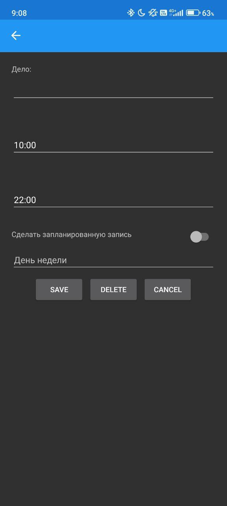

# Timetable (Ежедневник) 📱
Учебное мобильное приложение для планирования задач и создания напоминаний. Проект разработан с целью освоения мобильной разработки и работы с локальными базами данных.

## 🚀 Стек технологий
* **Framework:** [Xamarin.Forms](https://microsoft.com) (C#)
* **Database:** [SQLite](https://sqlite.org) — локальное хранение данных.

## 📋 Функционал
* **Автоопределение даты:** Приложение автоматически определяет текущий день для отображения актуальных задач.
* **Два типа записей:**
  1. **Разовые задачи:** Напоминания на конкретную выбранную дату.
  2. **Регулярные задачи:** Задачи, требующие постоянного внимания (повторяющиеся).
* **Локальное хранение:** Все данные сохраняются в SQLite, что позволяет работать с приложением без доступа к интернету.

### UI

| Основная страница | Страница редактирования записи |
|---|---|
|  |  |
